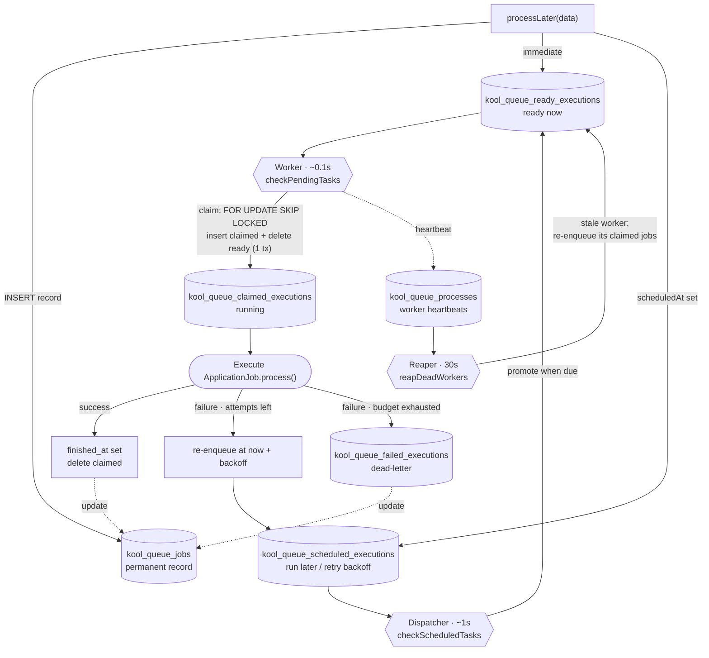
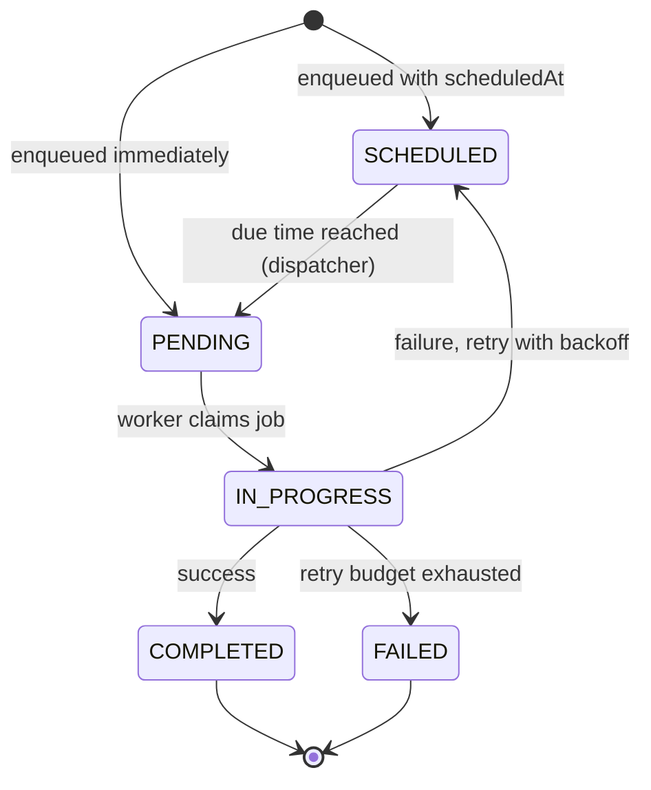

# Micronaut-Kool-Queue: DB-based queuing backend for Micronaut

Kool Queue is a DB-based queuing backend for Micronaut Framework, designed with simplicity and performance in mind.

Kool Queue runs on **PostgreSQL** and leverages the `FOR UPDATE SKIP LOCKED` clause to avoid blocking and waiting on locks when polling jobs.


# Installation

To get a Git project into your build:


### Gradle

Step 1. Add the JitPack repository to your build file

Add it in your root settings.gradle at the end of repositories:

```
	dependencyResolutionManagement {
		repositoriesMode.set(RepositoriesMode.FAIL_ON_PROJECT_REPOS)
		repositories {
			mavenCentral()
			maven { url 'https://jitpack.io' }
		}
	}
	
```
Step 2. Add the dependency

```
dependencies {
	        implementation 'com.github.joaquindiez:micronaut-kool-queue:0.3.2-SNAPSHOT'
	}

```

### Gradle.kts

Step 1. Add the JitPack repository to your build file
Add it in your settings.gradle.kts at the end of repositories:

```
	dependencyResolutionManagement {
		repositoriesMode.set(RepositoriesMode.FAIL_ON_PROJECT_REPOS)
		repositories {
			mavenCentral()
			maven { url = uri("https://jitpack.io") }
		}
	}
	
```
    
Step 2. Add the dependency

```
dependencies {
	        implementation("com.github.joaquindiez:micronaut-kool-queue:0.3.2-SNAPSHOT")
	}

```

### Maven

Add to pom.xml

```
<repositories>
		<repository>
		    <id>jitpack.io</id>
		    <url>https://jitpack.io</url>
		</repository>
	</repositories>
```

Step 2. Add the dependency

```
<dependency>
	    <groupId>com.github.joaquindiez</groupId>
	    <artifactId>micronaut-kool-queue</artifactId>
	    <version>0.3.2-SNAPSHOT</version>
	</dependency>
```


# High performance requirements

Kool Queue was designed for the highest throughput when used with PostgreSQL 9.5+, as it supports FOR UPDATE SKIP LOCKED.
You can use it with older versions, but in that case, you might run into lock waits if you run multiple workers for the same queue.


# Architecture

Kool Queue stores everything in SQL tables and drives all work with a few periodic in-process tasks. A producer writes a job into `kool_queue_jobs` plus a queue table; a **dispatcher** promotes scheduled jobs when they come due; a **worker** atomically claims ready jobs and runs them; and a **reaper** rescues jobs orphaned by crashed workers.

### Core tables

| Table | Role |
|-------|------|
| `kool_queue_jobs` | Permanent record of every job (metadata, lifecycle timestamps). |
| `kool_queue_ready_executions` | Jobs ready to run **now** — workers poll this. |
| `kool_queue_scheduled_executions` | Jobs to run **later** (delayed or awaiting a retry backoff). |
| `kool_queue_claimed_executions` | Jobs **currently being executed** by a worker. |
| `kool_queue_failed_executions` | **Dead-lettered** jobs that exhausted their retry budget. |
| `kool_queue_processes` | Live worker **heartbeats**, used to detect dead workers. |

### Queue flow



### Job status lifecycle

The status reported by `KoolQueueJobTracker` (`JobStatus`) follows this lifecycle:




# Configuration

## Database Setup

Kool Queue requires a configured datasource with JPA/Hibernate. The library uses database tables to store and manage job queues.

### Required Dependencies

Add these dependencies to your project:

**Gradle (Groovy)**
```groovy
dependencies {
    implementation 'io.micronaut.data:micronaut-data-hibernate-jpa'
    implementation 'io.micronaut.sql:micronaut-jdbc-hikari'
    runtimeOnly 'org.postgresql:postgresql'
}
```

**Gradle (Kotlin DSL)**
```kotlin
dependencies {
    implementation("io.micronaut.data:micronaut-data-hibernate-jpa")
    implementation("io.micronaut.sql:micronaut-jdbc-hikari")
    runtimeOnly("org.postgresql:postgresql")
}
```

**Maven**
```xml
<dependencies>
    <dependency>
        <groupId>io.micronaut.data</groupId>
        <artifactId>micronaut-data-hibernate-jpa</artifactId>
    </dependency>
    <dependency>
        <groupId>io.micronaut.sql</groupId>
        <artifactId>micronaut-jdbc-hikari</artifactId>
    </dependency>
    <dependency>
        <groupId>org.postgresql</groupId>
        <artifactId>postgresql</artifactId>
        <scope>runtime</scope>
    </dependency>
</dependencies>
```

### Datasource Configuration

Add the datasource configuration to your `application.yml`:

```yaml
datasources:
  default:
    url: jdbc:postgresql://localhost:5432/your_database
    username: your_username
    password: your_password
    driver-class-name: org.postgresql.Driver
    db-type: postgres
    dialect: POSTGRES

jpa:
  default:
    entity-scan:
      packages:
        - com.yourcompany.domain             # Your application entities
    properties:
      hibernate:
        hbm2ddl:
          auto: update  # Creates tables automatically
```
    
## Scheduler Configuration

All scheduler settings live under `micronaut.scheduler.kool-queue` and **every one is optional** — Kool Queue boots with sensible defaults, so you can omit the whole block. Add only what you want to override:

```yaml
micronaut:
  scheduler:
    kool-queue:
      enabled: true                      # master switch; false = no jobs are processed at all
      max-concurrent-tasks: 3            # max jobs running simultaneously
      default-interval: 30s              # default interval between task executions
      default-initial-delay: 10s         # delay before the first execution
      shutdown-timeout-seconds: 30       # max wait for in-flight jobs on graceful shutdown
      dead-worker-threshold-seconds: 60  # heartbeat age before a worker is reaped (keep well above 30s)
      max-attempts: 5                    # global retry budget before a job is dead-lettered
      retry-backoff-base-seconds: 5      # exponential backoff base: 5s, 10s, 20s, 40s, ...
      retry-backoff-max-seconds: 300     # cap on the backoff delay
      queues: []                         # queues this worker polls; [] (default) = ALL queues
      schema: null                       # Postgres schema for kool_queue_* tables (null = default schema)
      enable-management-endpoints: true  # expose the /kool-queue-scheduler admin endpoints
```

### Reference

| Property | Default | Description |
|----------|---------|-------------|
| `enabled` | `true` | Master switch. When `false` the scheduler does not start and **no jobs are processed**. |
| `max-concurrent-tasks` | `2` | Maximum number of jobs that can run simultaneously. |
| `default-interval` | `30s` | Default interval between task executions (`30s`, `5m`, `1h`). |
| `default-initial-delay` | `10s` | Delay before the first execution after startup. |
| `shutdown-timeout-seconds` | `30` | Max seconds to wait for in-flight jobs during graceful shutdown. |
| `dead-worker-threshold-seconds` | `60` | Seconds since a worker's last heartbeat before it is considered dead and reaped. **Must stay comfortably above 30s** — the reaper runs every 30s and a live worker's heartbeat age can legitimately reach ~30s, so a lower value risks reaping live workers. |
| `max-attempts` | `5` | Total attempts a job gets before it is moved to `failed_executions` (dead-lettered). `1` means no retry. Overridden per-job by `@KoolQueueJob(maxAttempts = N)`. |
| `retry-backoff-base-seconds` | `5` | Base delay for the exponential retry backoff. Delay before retry `n` (0-based) is `base * 2^n`. |
| `retry-backoff-max-seconds` | `300` | Upper bound on the exponential retry backoff delay. |
| `queues` | `[]` | Queues this worker polls, in priority order. **Empty (default) polls ALL queues.** See [Queue routing](#queue-routing) below. |
| `schema` | `null` | Postgres schema where Kool Queue's tables live. `null`/empty uses the connection's default schema (e.g. `public`); a non-empty value isolates tables as `<schema>.kool_queue_*` (must match `[A-Za-z_][A-Za-z0-9_]*`). |
| `enable-management-endpoints` | `true` | Exposes the admin endpoints described in [Management Endpoints](#management-endpoints). |

### Queue routing

By default `queues` is empty, which means **this worker polls every queue**, so jobs annotated with `@KoolQueueJob(queue = "emails")` are picked up without any extra configuration.

If you *do* set `queues`, the worker only polls the queues you list, in priority order — useful for dedicating nodes to specific workloads:

```yaml
micronaut:
  scheduler:
    kool-queue:
      queues: ["emails", "default"]   # this node only handles 'emails' and 'default'
```

> ⚠️ **Footgun:** once you set `queues`, any job enqueued to a queue *not* in the list will be stored in the database but **never processed** by this worker. Either leave `queues` empty (process everything) or make sure every queue you use in a `@KoolQueueJob(queue = ...)` is covered by at least one running worker.

### Per-job retry budget

The global `max-attempts` can be overridden per job class with `@KoolQueueJob`:

```kotlin
@KoolQueueJob(queue = "emails", maxAttempts = 3)
class EmailNotificationJob : ApplicationJob<EmailData>() { /* ... */ }
```

Failed jobs are retried with exponential backoff (`retry-backoff-base-seconds` × 2ⁿ, capped at `retry-backoff-max-seconds`). Once the attempt budget is exhausted the job is moved to `kool_queue_failed_executions` (dead-lettered).


# Usage

## 1. Create Your Job Class

Create a job by extending `ApplicationJob<T>` where `T` is the type of data your job will process, and annotate it with `@KoolQueueJob`:

```kotlin
@KoolQueueJob(queue = "emails")
class EmailNotificationJob : ApplicationJob<EmailData>() {

  private val logger = LoggerFactory.getLogger(javaClass)

  override fun process(data: EmailData): Result<Boolean> {
    val emailData = data as EmailData
    
    return try {
      // Your job logic here
      logger.info("Sending email to ${emailData.recipient}: ${emailData.subject}")
      
      // Simulate email sending
      Thread.sleep(1000)
      
      logger.info("Email sent successfully")
      Result.success(true)
    } catch (e: Exception) {
      logger.error("Failed to send email", e)
      Result.failure(e)
    }
  }
}

data class EmailData(
  val recipient: String,
  val subject: String,
  val body: String
)
```

`@KoolQueueJob` is meta-annotated with `@Singleton`, so the job is registered as
a bean automatically — no separate `@Singleton` needed. The queue a job routes
to is resolved with this precedence (highest first):

1. the `queue` argument of `processLater(data, queue = "...")`
2. an `override val queue: String = "..."` on the class (for dynamic/computed queues)
3. `@KoolQueueJob(queue = "...")`
4. the default queue (`"default"`)

> The legacy form — `@Singleton` plus `override val queue` — still works.

## 2. Queue Jobs for Processing

### From a Controller

```kotlin
@Controller("/notifications")
class NotificationController(private val emailJob: EmailNotificationJob) {

  @Post("/send-email")
  fun sendEmail(@Body emailData: EmailData): HttpResponse<String> {
    // Queue the job for background processing
    val jobRef =  emailJob.processLater(emailData)
    println("Job ID: ${jobRef.jobId}")
    
    return HttpResponse.ok("Email queued for sending")
  }
}
```

### From a Service

```kotlin
@Singleton
class UserService(private val emailJob: EmailNotificationJob) {

  fun registerUser(user: User) {
    // Save user to database
    userRepository.save(user)
    
    // Queue welcome email
    val welcomeEmail = EmailData(
      recipient = user.email,
      subject = "Welcome to our platform!",
      body = "Thank you for joining us, ${user.name}!"
    )
    
    emailJob.processLater(welcomeEmail)
  }
}
```

## 3. Job Execution

Jobs are automatically processed by the Kool Queue scheduler:
- A dispatcher moves due scheduled jobs into the ready queue (every ~1s), and workers poll the ready queue continuously (every ~0.1s) for jobs to run
- Respects the `max-concurrent-tasks` configuration
- Updates job status automatically (PENDING → IN_PROGRESS → COMPLETED/FAILED)
- Handles failures gracefully with retries and exponential backoff before dead-lettering

## Advanced Examples

### Complex Data Types

```kotlin
@Singleton
class DataProcessingJob : ApplicationJob<ProcessingRequest>() {

  override fun process(data: ProcessingRequest): Result<Boolean> {
    val request = data as ProcessingRequest
    
    return try {
      when (request.type) {
        "ANALYSIS" -> performAnalysis(request.payload)
        "EXPORT" -> exportData(request.payload)
        "CLEANUP" -> cleanupResources(request.payload)
        else -> throw IllegalArgumentException("Unknown processing type: ${request.type}")
      }
      
      Result.success(true)
    } catch (e: Exception) {
      Result.failure(e)
    }
  }
}

data class ProcessingRequest(
  val type: String,
  val payload: Map<String, Any>,
  val userId: Long,
  val timestamp: Instant = Instant.now()
)
```


# Tracking Job Status

`processLater()` returns a `JobReference` containing the job's unique `jobId` (a time-ordered UUID v7). Store that id to correlate the job with your domain entities and query its status later via `KoolQueueJobTracker`.

```kotlin
@Singleton
class OrderService(
  private val emailJob: EmailNotificationJob,
  private val jobTracker: KoolQueueJobTracker,
  private val orderRepository: OrderRepository
) {

  fun processOrder(order: Order) {
    // Enqueue and capture the reference
    val jobRef = emailJob.processLater(EmailData(order.customerEmail, "Confirmation", "..."))

    // Persist the job id for later correlation
    order.emailJobId = jobRef.jobId
    orderRepository.save(order)
  }

  fun checkEmailStatus(order: Order): JobStatus? =
    order.emailJobId?.let { jobTracker.getStatus(it)?.status }
}
```

`KoolQueueJobTracker` lets you query status (`getStatus`, `getStatusOnly`), check existence/completion (`exists`, `isComplete`), block until done (`awaitCompletion`), and read the failure reason (`getErrorMessage`). Status values are `PENDING`, `SCHEDULED`, `IN_PROGRESS`, `COMPLETED`, `FAILED`, and `NOT_FOUND`.

> 📖 Full API, examples, and the status-determination flow: **[docs/job-tracking.md](./docs/job-tracking.md)**.


# Management Endpoints

Kool Queue ships built-in [Micronaut management endpoints](https://docs.micronaut.io/latest/guide/#providedEndpoints) for monitoring the queue. They are enabled by default (`micronaut.scheduler.kool-queue.enable-management-endpoints: true`); you typically also expose the endpoint and decide whether it requires authentication:

```yaml
endpoints:
  kool-queue-scheduler:
    enabled: true
    sensitive: false   # set to true to require authentication
```

| Endpoint | Method | Path | Description |
|----------|--------|------|-------------|
| Scheduler stats | GET | `/kool-queue-scheduler` | Active/registered tasks, total/successful/failed executions, success rate. |
| Pending tasks | GET | `/kool-queue-scheduler/tasks` | Paginated list of jobs waiting to run (`?page=0&size=20`, max size 100). |
| In-progress tasks | GET | `/kool-queue-scheduler/in-progress` | Paginated list of jobs currently executing (`?page=0&size=20`, max size 100). |

```bash
curl http://localhost:8080/kool-queue-scheduler
curl "http://localhost:8080/kool-queue-scheduler/tasks?page=0&size=20"
curl "http://localhost:8080/kool-queue-scheduler/in-progress?page=1&size=50"
```

> 📖 Full request/response schemas and field-by-field reference: **[micronaut-kool-queue-core/README.md](./micronaut-kool-queue-core/README.md#-management-endpoints)**.


# Inspiration

Kool Queue has been inspired by [Solid Queue](https://github.com/rails/solid_queue) and Rails.
We recommend checking out these projects as they're great examples from which we've learnt a lot.

# License

The library is available as open source under the terms of the [APACHE 2.0](./LICENSE)
