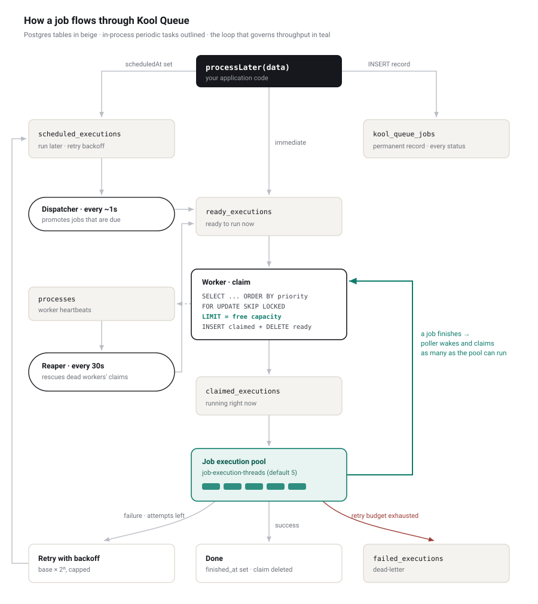

# Article assets

`kool-queue-architecture.svg` is the source; the PNG is generated from it (the
newsletter platforms this article is published on do not accept SVG).

```bash
printf '<!doctype html><style>html,body{margin:0;background:#fff}img{display:block;width:900px;height:1010px}</style>' > /tmp/wrap.html
chromium --headless --disable-gpu --no-sandbox --hide-scrollbars \
  --force-device-scale-factor=2 --window-size=900,1140 \
  --default-background-color=FFFFFFFF --screenshot=/tmp/full.png file:///tmp/wrap.html
# then crop /tmp/full.png to the first 2000 rows — Chromium reserves part of the
# viewport, so it must be rendered taller than the artwork and trimmed.
```
